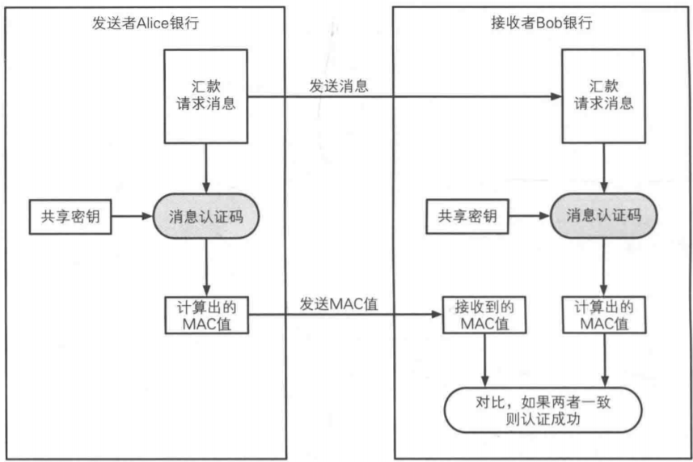
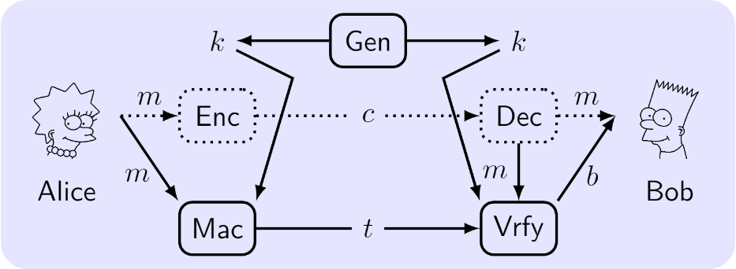
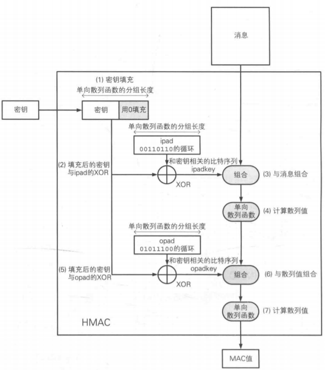

# 消息认证码 (MAC)
消息认证码是将key和消息msg混合后输出一个用于认证的auth_code。
```mermaid
graph LR
    A(key) -- input --> B(MAC-Algo)
    C(msg) -- input --> B
    B -- output --> D(mac_code)
```
<!-- more -->
## MAC使用的步骤

1. 发送者与接收者预先共享密钥key。
2. 发送者根据共享密钥key来计算消息msg的MAC值。
3. 发送者将消息msg和MAC发送给接收者。
4. 接收者根据收到的msg来计算mac。
5. 接收者比较自己计算的mac和接受到的mac。
6. 如果一致，则认证成功；反之，认证失败。

## 认证加密
encrypt-then-mac：先将明文加密，然后计算密文的MAC值。实际场景下message在channel中通常是加密的，这种情形下可以用MAC来认证加密消息。

## MAC的应用示例
- SWIFT
- IPsec
- SSL/TLS

## 常见的MAC算法

- 基于hash的MAC算法
  - HMAC (Hash-based MAC, e.g. HMAC-SHA256)
  - KMAC (Keccak-based MAC)
- 基于对称加密的MAC算法
  - CMAC (Cipher-based MAC)
  - GMAC (Galois MAC)
  - Poly1305 (Bernstein's one-time authenticator)
- 其他
  - UMAC (based on universal hashing)-
  - VMAC (high-performance block cipher-based MAC)
  - SipHash (simple, fast, secure MAC)

### HMAC原理

hmac是一种常见的mac算法，其构造的原理如图所示：

其中：

- **IV**：随机生成的向量
- **k**: 就是mac算法需要的key
- **ipad**：0x5C的填充
- **opad**: 0x36的填充
- **m**: message被分割成的若干端
- **t**：最后的输出

## 对MAC的攻击

### 重放攻击
攻击者事先保存正确的MAC值，不断重放来发动攻击。

**防御办法：**
1. **序列号**：消息中使用一个递增的序列号，使得每次的消息都不一样
2. **时间戳**: 消息中添加时间戳，接收者根据时间戳来判断是不是历史消息。
3. **nonce**: 消息中增加nonce随机数，每个消息的nonce都不一样，这样可用防止重放攻击。

### 密码推测攻击
攻击者通过某种手段猜测密码。
